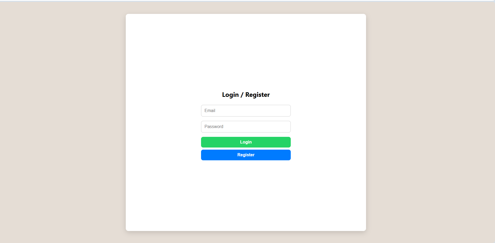
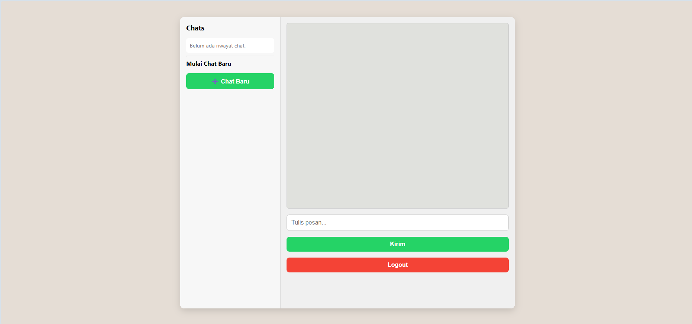
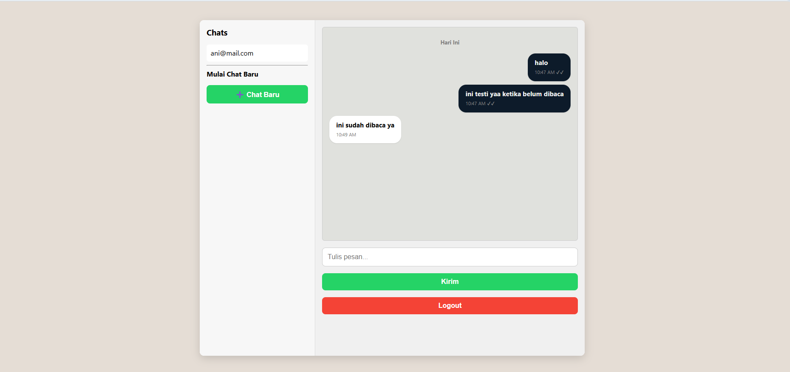
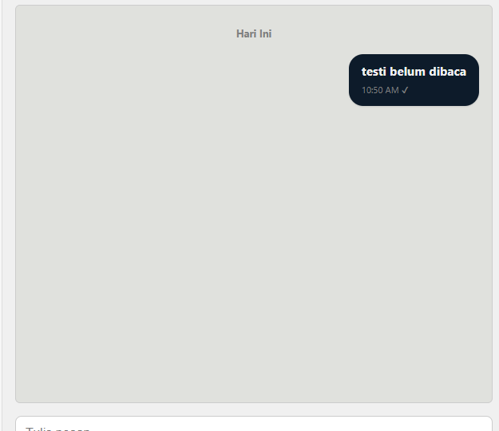
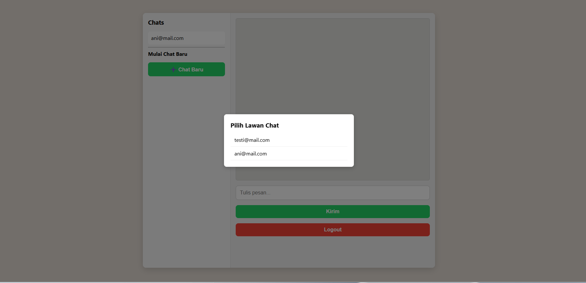

# 🔥 Firebase Simple Chat

A minimalist **1-on-1 real-time chat app** powered by **Firebase Realtime Database** and **Authentication**, built using **HTML**, **CSS**, and **jQuery** — no frameworks needed.

🔗 **Live Demo:** [https://mrohid127.github.io/firebase-simple-cha/](https://mrohid127.github.io/firebase-simple-cha/)

---

## ✨ Features

- ✅ Login / Register with Firebase Auth
- 📄 Auto-populated user list from database
- 💬 Real-time personal chat (1-on-1)
- ✔✔ Message read indicators
- 🆕 Start new chats via custom modal
- 📅 Auto-date separators (e.g. Today / Yesterday)
- 🔒 Persistent sessions (auto-login)
- 🔔 Unread message highlights (bold)
- 🔐 Clean logout with listener cleanup

---

## 🖼️ UI Screenshots

### 🟦 1. Login & Register Page

### 📑 2. Chat Window (No conversation yet)

### 🧍 3. Modal to Select Chat Recipient

### 🔔 4. Unread Message Highlight

### 📤 5. Modal showing available users

---

## 🚀 How to Run

1. **Clone** this repo or download the ZIP
2. Open `index.html` directly in your browser
3. Test using two different accounts to simulate 1-on-1 chat

✅ No backend required  
✅ Firebase integrated directly via CDN

---

## 📁 Folder Structure

├── index.html
├── script.js
├── style.css
└── assets/
└── screenshots/
├── belumdibaca.png
├── loginregister.png
├── polos.png
├── sudahdibaca.png
└── modal.png

---

## 👤 Created by

**Muhammad Rohid**  
📧 Email: [mrohid99@gmail.com](mailto:mrohid99@gmail.com)  
📱 WhatsApp: 0822-8480-5573

---
